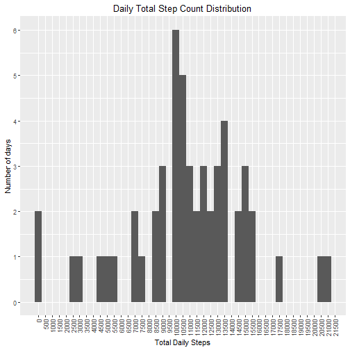
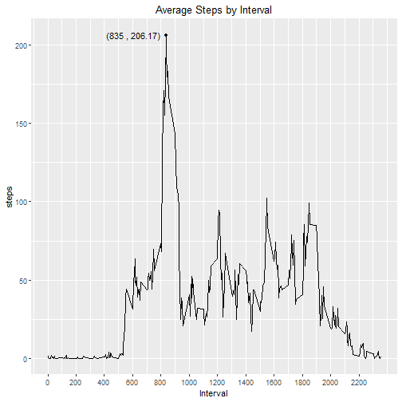
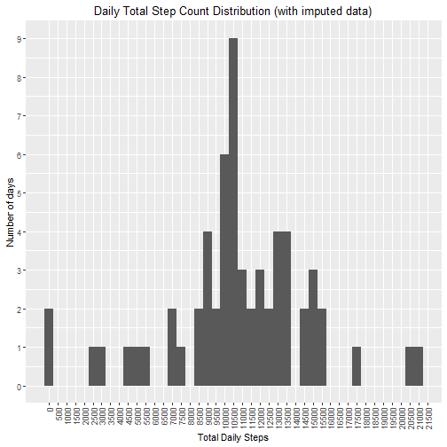
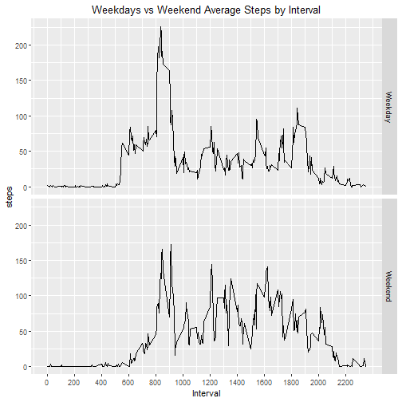

For this analysis, we will rely on a single table of data on Activity Monitoring in csv format. The data file includes 3 variables

* steps: Number of steps taking in a 5-minute interval (missing values are coded as NA\color{red}{\verb|NA|}NA)
* date: The date on which the measurement was taken in YYYY-MM-DD format
* interval: Identifier for the 5-minute interval in which measurement was taken

## Loading and preprocessing the data
Following packages are used in this analysis.


```r
library(dplyr)
library(lubridate)
library(ggplot2)
```

Activity file is read into activity table using headers in the file


```r
download.file(url="https://d396qusza40orc.cloudfront.net/repdata%2Fdata%2Factivity.zip", destfile="Steps.zip")
unzip("Steps.zip")
 activity<-read.csv("activity.csv", header=TRUE, colClasses = c("numeric","Date","numeric"), na.strings = "NA")
```

A sample of data in activity table looks as below:


```r
head(activity)
```

```
##   steps       date interval
## 1    NA 2012-10-01        0
## 2    NA 2012-10-01        5
## 3    NA 2012-10-01       10
## 4    NA 2012-10-01       15
## 5    NA 2012-10-01       20
## 6    NA 2012-10-01       25
```

## What is mean total number of steps taken per day?

Most fitness goals center around hitting a certain number of total steps for each day, however the target step count can be customised per individual.

In our data set, the __mean__ daily total step was found to be __10766.19__. The __median__ of daily step count was __10765.00__ steps per day fitting nicely with the popular 10000 steps a day target.

However, it's also important to see how many days are actually below target step count to get a sense of consistency with this goal. For this, we will calculate sum of steps by day (ignoring missing values) and plot a histogram.


```r
dailySteps<- activity[!is.na(activity$steps),] %>% group_by(date) %>% summarise(steps = sum(steps))
ggplot(aes(steps),data=dailySteps)+ggtitle("Daily Total Step Count Distribution") + geom_histogram(binwidth = 500) + scale_x_continuous(name="Total Daily Steps", breaks = seq(0,21500,500), minor_breaks = NULL)+theme(plot.title = element_text(hjust = 0.5), axis.text.x = element_text(angle = 90, hjust = 1, vjust=0.5))+scale_y_continuous(name = "Number of days", breaks=0:10)
```




## What is the average daily activity pattern?

It is also relevant to look at when during an average day most of the steps are taken. For this, we will have a look at average steps for each 5 minute interval across all days in our data set.


```r
stepsByInterval<- activity[!is.na(activity$steps),] %>% group_by(interval) %>% summarise(steps = mean(steps, na.rm = TRUE))
ggplot(aes(interval,steps),data=stepsByInterval)+geom_line()+ggtitle("Average Steps by Interval")+labs(ylab = "Steps")+scale_x_continuous(name="Interval", breaks = seq(0,2355,200))+theme(plot.title = element_text(hjust = 0.5))+geom_text(aes(interval,steps,label=paste("(", interval," , ",round(steps,2),")", sep="")),data=stepsByInterval[stepsByInterval$steps==max(stepsByInterval$steps),] , hjust=1.1) +geom_point(aes(interval,steps),data=stepsByInterval[stepsByInterval$steps==max(stepsByInterval$steps),] )
```



As you can see from the plot above, the highest average step count for any 5 min interval is __206.17__ and is recorded for the 5 min interval starting at __8:35__

## Imputing missing values

So far, the analysis has ignored the inherit missing step counts in the data set. However, when we look at the volume of missing values - we see out of 17568 observations, __2304__ do not have a step count, which means 13.11% of the data is being ignored. 

To work around this problem, we will populate the missing values by averaging the existing values for that interval within that week (a week is defined Mon to Sun). This will be done by grouping values by week no and interval and left joining that lookup with original data
set to add the missing values.

Results will be stored in activity2 table.


```r
activity_temp<-activity[is.na(activity$steps),]
activity_temp$WeekNo <- format(as.Date(activity_temp$date), "%W")
weeklyintervals <- activity[!is.na(activity$steps),] %>% group_by(WeekNo=format(date, "%W"),interval) %>% summarise (avgsteps=mean(steps))
activity_temp<-merge(activity_temp,weeklyintervals, by=c("WeekNo","interval"))
activity_temp<- data.frame(steps=activity_temp$avgsteps, date=activity_temp$date, interval=activity_temp$interval)
activity2<- rbind(activity[!is.na(activity$steps),],activity_temp)
rm(activity_temp)
```

Using the new data set, if we repeat the step count distribution, we will see that the number of days have gone up across the board



```
##   mean(steps) median(steps) 
##      10705.88      10553.83
```

When we imputed the data, the __mean__ has gone down from __10766.19__ to __10705.88__. The __median__ of daily step count changed from __10765.00__  to __10553.83__. 

## Are there differences in activity patterns between weekdays and weekends?

If we continue with the imputed data set and group our days by weekend (defined as Saturday and Sunday) vs weekdays, we can see some differences within day step patterns. The figure shows average step counts for each interval for weekdays vs weekends.

```r
activity2$isWeekEnd <-factor(weekdays(activity2$date) %in% c("Saturday","Sunday"), labels=c("Weekday","Weekend"), ordered=TRUE)
stepsByInterval<- activity2 %>% group_by(interval, isWeekEnd) %>% summarise(steps = mean(steps, na.rm = TRUE))
ggplot(aes(interval,steps),data=stepsByInterval)+ggtitle("Weekdays vs Weekend Average Steps by Interval")+geom_line()+scale_x_continuous(name="Interval", breaks = seq(0,2355,200))+labs(ylab = "Steps")+theme(plot.title = element_text(hjust = 0.5))+facet_grid(isWeekEnd~.)
```



From the chart, weekdays seem to have higher average step counts for intervals between 05:00 and 09:00 - possibly related to a work commute or morning exercise, whereas weekends show higher averages between 12:00 and 16:00 which may be related to free time activities on the weekends vs sedentary work conditions during the week.
